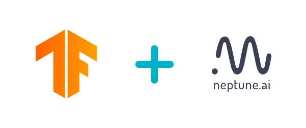

# neptune-tensorboard
[](https://badge.fury.io/py/neptune-tensorboard)
[](https://travis-ci.org/neptune-ai/neptune-tensorboard)



# Overview
`neptune-tensorboard` integrates `TensorBoard` with `Neptune` to let you get the best of both worlds.
Enjoy tracking from `TensorBoard` with organization and collaboration of `Neptune`.

With `neptune-tensorboard` you can have your `TensorBoard` experiment runs hosted in a beautiful knowledge repo that lets you invite and manage project contributors. 

All you need to do is go to your command line and run:

```
neptune tensorboard /path/to/logdir --project USER_NAME/PROJECT_NAME
```

and you have your [experiments](https://ui.neptune.ai/jakub-czakon/tensorboard-integration/experiments?filterId=bcef6881-128a-4126-a582-31b179bebf67) hosted on Neptune:


and easily [sharebale](https://ui.neptune.ai/jakub-czakon/tensorboard-integration/compare?shortId=%5B%22TEN-40%22%2C%22TEN-39%22%2C%22TEN-38%22%2C%22TEN-37%22%2C%22TEN-36%22%2C%22TEN-35%22%2C%22TEN-34%22%2C%22TEN-33%22%2C%22TEN-32%22%2C%22TEN-31%22%5D) with the world:


# Documentation
See [neptune-tensorboard docs](https://docs.neptune.ai/integrations/tensorboard.html) for more info.

# Get started

## Register
Go to [neptune.ai](http://bit.ly/2uUd9AB) and sign up.

It is completely free for individuals and non-organizations, and you can invite others to join your team!

## Get your API token
In order to start working with Neptune you need to get the API token first.
To do that, click on the `Get API Token` button on the top left.


## Set NEPTUNE_API_TOKEN environment variable
Go to your console and run:

```
export NEPTUNE_API_TOKEN='your_long_api_token'
```

## Create your first project
Click on `Projects` and the `New project`. Choose a name for it and whether you want it public or private.


## Install lib

```bash
pip install neptune-tensorboard
```

## Sync your TensorBoard logdir with Neptune

```bash
neptune tensorboard /path/to/logdir --project USER_NAME/PROJECT_NAME
```

## Explore and Share
You can now explore and organize your experiments in Neptune:


And share it with anyone by sending a link to your project, experiment or chart if it is public
or invite people to your project if you want to keep it private!


# Getting help
If you get stuck, don't worry we are here to help.
The best order of communication is:

 * [neptune-tensorboard docs](https://docs.neptune.ai/integrations/tensorboard.html)
 * [github issues](https://github.com/neptune-ai/neptune-tensorboard/issues)
 * [neptune community spectrum](https://spectrum.chat/neptune-community)

# Contributing
If you see something that you don't like you are more than welcome to contribute!
There are many options:

  * Participate in discussions on [neptune community spectrum](https://spectrum.chat/neptune-community)
  * Submit a feature request or a bug here, on Github
  * Submit a pull request that deals with an open feature-request or bug
  * Spread a word about neptune-contrib in your community
